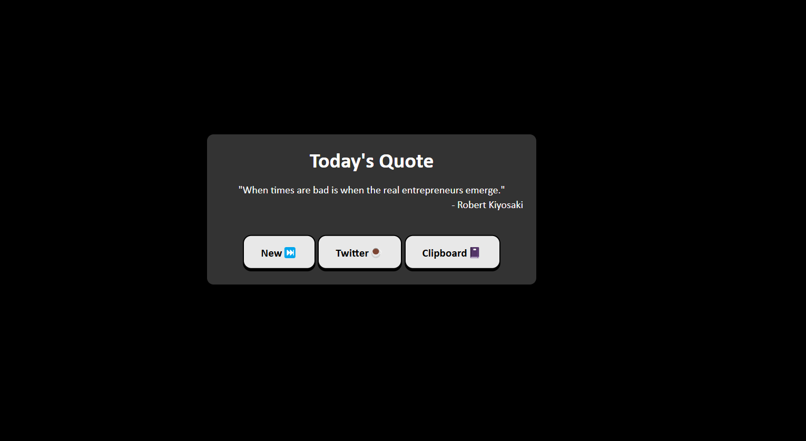
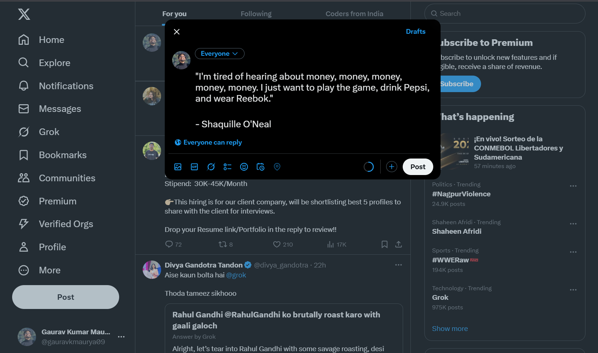
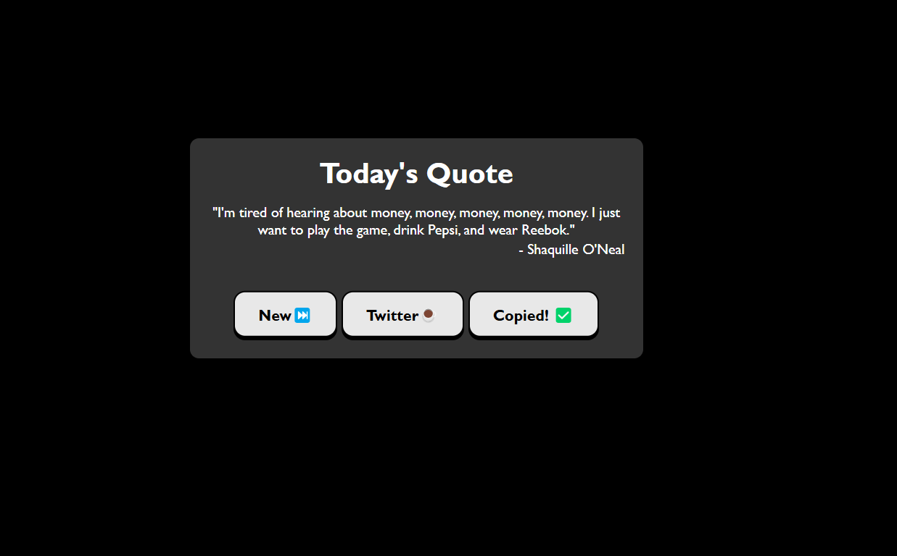

# Quote Scroll

Quote Scroll is a simple web application that fetches random quotes from an API
-
🔗 [Click here for API Used in here](https://freeapi.hashnode.space/api-guide/apireference/getARandomQuote)

## 🌍 Deployment

The application is live and accessible at:
🔗 [Quote Scroll](https://quote-scroll.vercel.app/)

## 🚀 Features
- 🎲 **Random Quotes** – Fetches a new random quote with every click.
- 📋 **Copy to Clipboard** – Quickly copies the quote to your clipboard.
- 🐦 **Tweet the Quote** – Instantly share quotes on Twitter.

## 🛠️ Technologies Used
- HTML
- CSS
- JavaScript
- Fetch API
- Vercel (for deployment)

## 📸 Screenshots
### First Look

### When clicked on Twitter Btn

### When clicked on clipboard Btn

## 📖New Things that I have known

📌 . URL Encoding for Tweet Button

- encodeURIComponent(): 🔗 [MDN DOC](https://developer.mozilla.org/en-US/docs/Web/JavaScript/Reference/Global_Objects/encodeURIComponent)

- Opening a New Tab (window.open()): 🔗 [MDN DOC](https://developer.mozilla.org/en-US/docs/Web/API/Window/open)

📌 . Clipboard API (Copy to Clipboard Feature)

- navigator.clipboard.writeText(): 🔗 [MDN DOC](https://developer.mozilla.org/en-US/docs/Web/API/Clipboard/writeText)

